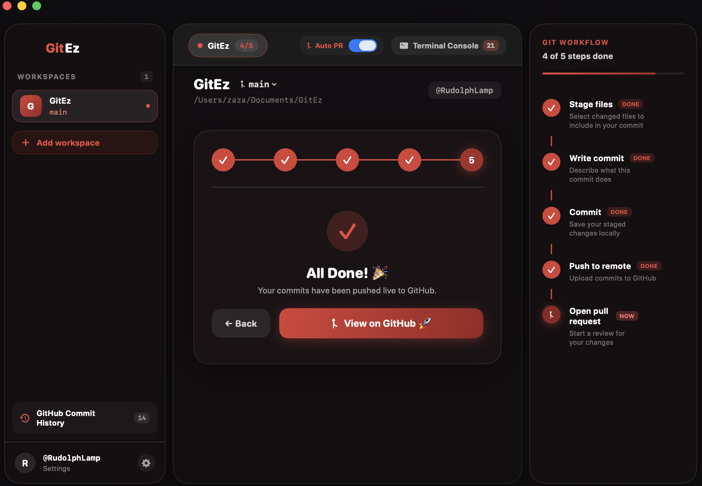

<div align="center">


# GitEz

### *The Ultimate Step-by-Step GitHub Workflow Client for macOS*

[](https://github.com/RudolphLamp/GitEz)
[](https://github.com/RudolphLamp/GitEz/releases/tag/v1.1.0)
[](https://developer.apple.com/swift/)
[](LICENSE)

<br/>

[**📥 Download GitEz.dmg (v1.1.0)**](https://github.com/RudolphLamp/GitEz/releases/tag/v1.1.0) &nbsp;•&nbsp; [**✨ View Features**](#-key-features) &nbsp;•&nbsp; [**📸 Screenshots**](#-interface-gallery)

</div>

---

## 🚀 What is GitEz?

**GitEz** is a native macOS developer tool designed to make Git and GitHub workflows effortless. Instead of struggling with complex CLI flags or cluttered UI tables, GitEz guides you through a **single-step focused wizard pipeline** wrapped in a **macOS 27 Liquid Glass** design language.

---

## 📸 Interface Gallery

<div align="center">

### 1. Main Workspace & Guided 5-Step Pipeline


<br/><br/>

### 2. Single Focused Step Wizard & Circular Progress Stepper


<br/><br/>

### 3. Live Git Workflow Timeline & Real-Time Status


</div>

---

## ✨ Key Features

<table>
  <tr>
    <td width="50%">
      <h3>🎯 Single-Step Focused Wizard</h3>
      <p>Never get overwhelmed by cluttered UI tables. GitEz presents <b>one focused step at a time</b> with step navigation (<code>← Back</code> / <code>Next →</code>) and a circular progress indicator.</p>
    </td>
    <td width="50%">
      <h3>🎨 macOS 27 Liquid Glass UI</h3>
      <p>Built natively with translucent backdrop materials, floating glass panels, 24px rounded corners, and a curated <b>Tinted Dark Crimson Red</b> theme matching the app icon.</p>
    </td>
  </tr>
  <tr>
    <td width="50%">
      <h3>🔀 Remote Branch Discovery</h3>
      <p>Automatically pulls all live branches from GitHub via <code>git ls-remote</code>. Switch branches seamlessly or create and checkout new feature branches on the fly.</p>
    </td>
    <td width="50%">
      <h3>⚡️ Built-in IDE Launcher</h3>
      <p>One-click workspace launcher to open your project directly in <b>Visual Studio Code</b>, <b>Cursor</b>, <b>Antigravity</b>, <b>Terminal</b>, or <b>Finder</b>.</p>
    </td>
  </tr>
  <tr>
    <td width="50%">
      <h3>🧠 Real-Time Terminal Console</h3>
      <p>Live output drawer displaying exact CLI commands, stdout, stderr, and exit codes with single-click log copy and clear tools.</p>
    </td>
    <td width="50%">
      <h3>🕒 GitHub Commit History Pop-up</h3>
      <p>Interactive pop-up modal listing recent workspace commits with direct links to view exact commits and diffs live on GitHub.</p>
    </td>
  </tr>
</table>

---

## ⚡ 5-Step Guided Workflow Pipeline

```
┌──────────────┐     ┌──────────────┐     ┌──────────────┐     ┌──────────────┐     ┌──────────────┐
│  1. STAGE    │ ──> │  2. COMMIT   │ ──> │  3. BRANCH   │ ──> │   4. PUSH    │ ──> │  5. OPEN PR  │
│ Select files │     │ Write message│     │ Select target│     │ Sync remote  │     │ Launch GH PR │
└──────────────┘     └──────────────┘     └──────────────┘     └──────────────┘     └──────────────┘
```

---

## 📥 Installation

### Option 1: Download pre-built DMG Installer (Recommended)
1. Download **`GitEz.dmg`** from the [Releases](https://github.com/RudolphLamp/GitEz/releases/tag/v1.1.0) page.
2. Double-click `GitEz.dmg` to open the installer.
3. Drag **GitEz** into your `Applications` folder.
4. Launch GitEz and enjoy simple GitHub workflows!

### Option 2: Build from Source

**Requirements:**
- macOS 14.0 or later (macOS 15/27 recommended)
- Xcode 15.0 or later

```bash
# 1. Clone repository
git clone https://github.com/RudolphLamp/GitEz.git
cd GitEz

# 2. Build Release bundle
xcodebuild -project GitEz.xcodeproj -scheme GitEz -configuration Release build

# 3. Launch application
open /Users/zaza/Library/Developer/Xcode/DerivedData/GitEz-*/Build/Products/Release/GitEz.app
```

---

## 📄 License

Distributed under the MIT License. See `LICENSE` for more information.

<div align="center">
  <sub>Built with ❤️ for macOS developers</sub>
</div>