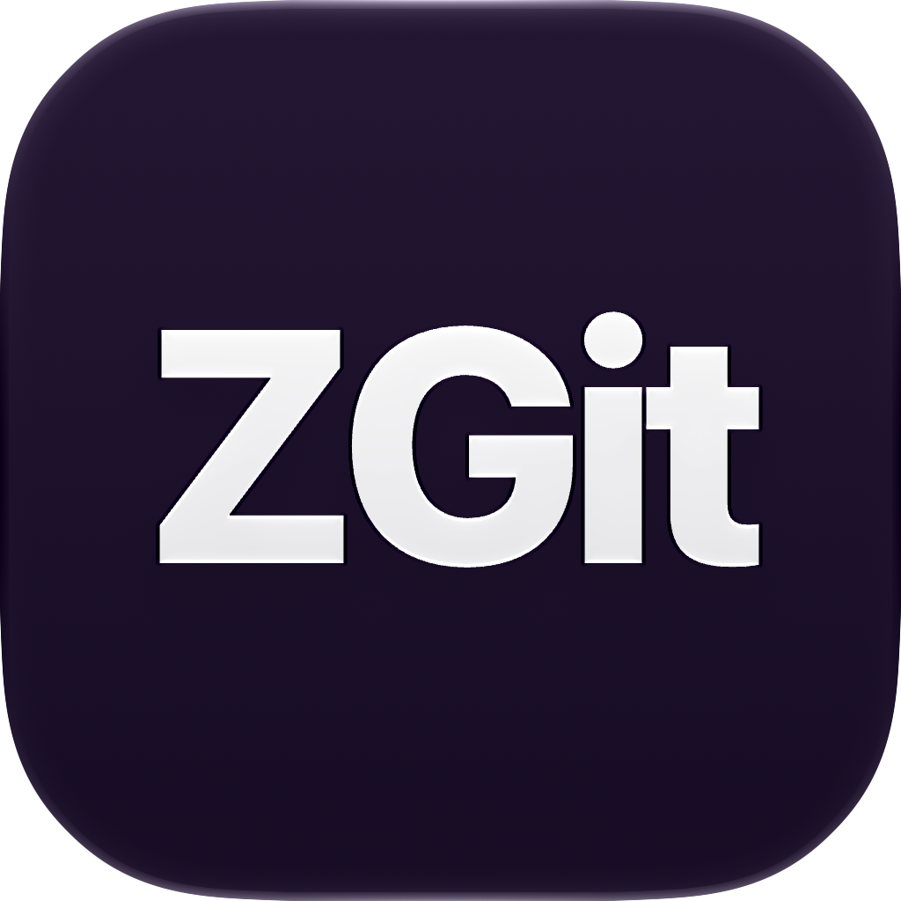
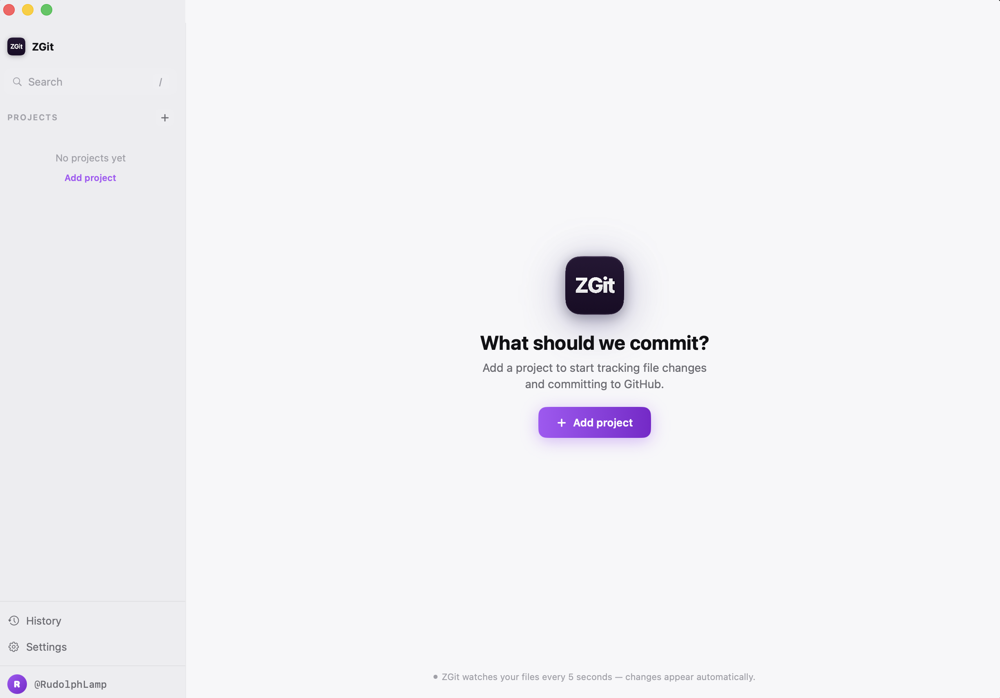
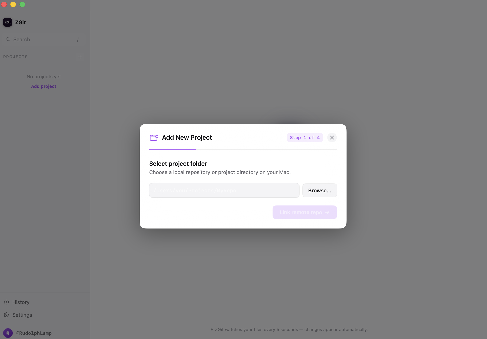
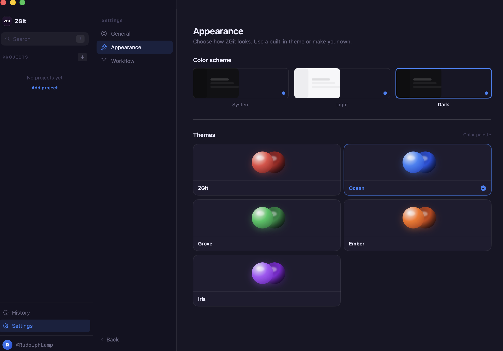

<div align="center">



# ZGit

### *The Ultimate Minimalist & Safety-First GitHub Workflow Client for macOS*

[](https://github.com/RudolphLamp/GitEz)
[](https://github.com/RudolphLamp/GitEz/releases/tag/v2.0.0)
[](https://developer.apple.com/swift/)
[](LICENSE)

<br/>

[**📥 Download ZGit.dmg (v2.0.0)**](https://github.com/RudolphLamp/GitEz/releases/tag/v2.0.0) &nbsp;•&nbsp; [**✨ Deep Dive Features**](#-in-depth-features) &nbsp;•&nbsp; [**📸 Interface Tour**](#-interface-tour) &nbsp;•&nbsp; [**🏗 Architecture**](#-architecture--codebase-structure)

</div>

---

## 🚀 Overview & Design Philosophy

**ZGit** is a native, ultra-fast macOS developer application designed to streamline daily Git operations and GitHub pull request workflows. Inspired by modern developer environments like **T3 Code**, ZGit replaces overwhelming Git desktop tables and noisy CLI outputs with an elegant, focused developer dashboard.

Built from the ground up using **SwiftUI** and native **AppKit integration**, ZGit enforces **strict repository safety**, eliminating common Git mistakes such as accidental commit of merge conflict markers or silent rebase corruption.

### 🎨 Key Design Principles
* **Zero Cognitive Overhead**: A focused, single-task workflow pipeline where each step has a clear purpose.
* **T3-Inspired Minimal Aesthetics**: Ultra-clean sidebars, breadcrumb toolbar paths, and deep purple-indigo dark palettes (`#171625`).
* **macOS 27 Liquid Glass Language**: Native translucent window materials, continuous squircle radii, and glossy 3D sphere theme pickers.
* **Proactive Safety & Integrity**: Automatic pre-commit conflict scanning, non-destructive branch checkouts, and safe remote tracking.

---

## 📸 Interface Tour

<div align="center">

### 1. Minimal T3 Workspace & Guided Breadcrumb Pipeline
*Breadcrumb navigation, live branch selector, IDE launcher, and instant workspace change tracking.*
<br/><br/>


<br/><br/><br/>

### 2. Integrated Per-Line Code Diff Viewer
*Drawer panel featuring real-time diff parsing, syntax line highlighting (+ / -), and file collapse controls.*
<br/><br/>


<br/><br/><br/>

### 3. Theme Customizer & 3D Gradient Sphere Picker
*Interactive theme selector with 3D glossy sphere previews (ZGit, Ocean, Grove, Ember, Iris).*
<br/><br/>


</div>

---

## ✨ In-Depth Features

### ⏱️ 1. "Changes from Now" Baseline Time-Tracker
When opening large existing repositories or multi-branch **Git Worktrees**, traditional Git clients flood the screen with dozens of pre-existing untracked or uncommitted files.
* **Timestamp Snapshot Engine**: Opening or selecting a workspace establishes a baseline timestamp ($T_0$).
* **Filesystem Mod-Date Filter**: ZGit inspects the modification date of files reported by `git status --porcelain -uall`. Only files created or modified **after** $T_0$ appear in the staging pipeline.
* **Instant Mode Switching**: Toggle between `[Changes from now]` (focused on current session) and `[All files]` (full status view) anytime from the top bar with a single click.

### 🛡️ 2. Pre-Stage & Pre-Commit Conflict Marker Guard
Accidentally committing Git merge conflict markers (`<<<<<<< HEAD`, `=======`, `>>>>>>>`) ruins commit history and breaks build pipelines.
* **Automated `git diff --check` Inspection**: Before any file is staged or committed, ZGit scans the working directory for leftover conflict markers.
* **Hard Staging Halt**: If any conflict markers are detected, staging and committing are immediately **HALTED**, displaying an explicit warning banner detailing the exact files requiring manual resolution.
* **Non-Destructive Push Protection**: Automatically disables background `git pull --rebase` on push rejections, ensuring remote changes never overwrite local files with unresolved conflict markers.

### 💬 3. T3-Style Chat-Composer Commit System
* **Multi-Line Text Editor**: Fluid text area for writing detailed, structured commit messages.
* **Semantic Prefix Chips**: One-click prefix insertions (`feat:`, `fix:`, `chore:`, `docs:`, `test:`) to enforce Conventional Commit standards effortlessly.
* **Circular Send Button**: T3-style action button with built-in validation (disabled when input is empty or conflict markers exist).

### 📄 4. Integrated Code Diff Drawer
* **Live Differential Parser**: Parses `git diff` output on demand and renders structured code blocks.
* **Per-Line Color Coding**: Additions highlighted in vibrant green (`#4ADE80`), deletions in soft crimson (`#F87171`).
* **Collapsible File Sections**: Collapse or expand individual file diffs to focus on relevant code modifications.

### 🎨 5. Theme Engine & 3D Sphere Customization
* **Curated Color Palettes**: Built-in accent presets including **ZGit** (Deep Purple), **Ocean** (Teal-Cyan), **Grove** (Emerald Green), **Ember** (Warm Crimson), and **Iris** (Lavender).
* **3D Gradient Sphere Cards**: Rendered with radial gradients and specular gloss ellipses to preview theme combinations.
* **Environment-Injected Color Tokens**: Propagates `ThemeColors` across every sidebar, modal, button, and text element dynamically.

### ⚡️ 6. IDE Launcher & Worktree Safety
* **One-Click IDE Launching**: Launch workspaces directly in **VS Code**, **Cursor**, **Antigravity**, **Terminal**, or **Finder**.
* **Worktree-Aware Branch Checkout**: Verifies active branch before switching. If a branch is already checked out in a Git worktree, ZGit bypasses redundant `git checkout` commands to avoid `already checked out` fatal errors.

---

## ⚡ Workflow Pipeline

```
┌─────────────────┐      ┌─────────────────┐      ┌─────────────────┐      ┌─────────────────┐
│   1. STAGE      │ ───> │   2. COMMIT     │ ───> │    3. PUSH      │ ───> │   4. OPEN PR    │
│  Select files   │      │  Chat composer  │      │  Push to remote │      │  View on GitHub │
│  (Conflict check)      │  (Prefix chips) │      │  (Safe push)    │      │  (One-click PR) │
└─────────────────┘      └─────────────────┘      └─────────┬───────┘      └─────────────────┘
                                                            │
                                                     (If rejected)
                                                            ▼
                                                 ┌───────────────────┐
                                                 │ Safe Error Alert  │
                                                 │ (No auto-rebase)  │
                                                 └───────────────────┘
```

---

## 🏗 Architecture & Codebase Structure

ZGit follows a clean, single-responsibility Swift architecture built on top of an `ObservableObject` state hub (`GitService`):

```
GitEz/
├── GitEzApp.swift               # macOS App entry point & 512x512 squircle Dock icon generator
├── GitService.swift             # Central reactive state manager & async Git process runner
├── GitModels.swift               # Data models (Workspace, GitStatusInfo, CommitLogItem, Theme)
├── ContentView.swift            # Main window view router & theme environment injector
├── SidebarView.swift            # T3-style left sidebar, workspace list & user footer
├── MainFeedView.swift           # Central workflow view, breadcrumb toolbar & chat composer
├── ScenarioAView.swift          # Theme token system, AccentPresets & Color(hex:) extensions
├── ScenarioBView.swift          # CodeDiffView git diff parser & line highlighter
├── SettingsView.swift           # In-app settings page with 3D Sphere Pair theme cards
├── AddWorkspaceModalView.swift  # 4-step wizard modal for adding local project folders
├── CommitHistoryModalView.swift # Commit history modal with direct GitHub links
└── Assets.xcassets/             # Liquid Glass app icon assets & image sets
```

---

## ⌨️ Keyboard Shortcuts & Quick Actions

| Shortcut | Action | Description |
| :--- | :--- | :--- |
| `⌘ K` | **Search Projects** | Focus project search bar in sidebar |
| `/` | **Quick Filter** | Jump to search input |
| `⌘ R` | **Refresh Status** | Force-refresh Git status and branch list |
| `Diff Button` | **Toggle Diff Drawer** | Open/close bottom code diff panel |
| `Changes from now` | **Toggle Baseline** | Switch between session changes & all untracked files |

---

## 📥 Installation & Setup

### Option 1: Download Pre-Built DMG (Recommended)
1. Download **`ZGit.dmg`** from the [Releases](https://github.com/RudolphLamp/GitEz/releases/tag/v2.0.0) section.
2. Open `ZGit.dmg` and drag **ZGit.app** to your `Applications` folder.
3. Launch ZGit and start tracking your repositories!

### Option 2: Build from Source

#### Prerequisites
* **macOS 14.0+** (macOS 15/27 recommended)
* **Xcode 15.0+** or **Xcode Beta**
* **Command Line Tools** installed (`xcode-select --install`)

```bash
# 1. Clone repository
git clone https://github.com/RudolphLamp/GitEz.git
cd GitEz

# 2. Build Debug or Release target using Xcode / xcodebuild
xcodebuild -project GitEz.xcodeproj -scheme GitEz -configuration Release build

# 3. Launch application
open ~/Library/Developer/Xcode/DerivedData/GitEz-*/Build/Products/Release/GitEz.app
```

---

## 📄 License

Distributed under the MIT License. See `LICENSE` for details.

<div align="center">
  <br/>
  <sub>Built with ❤️ for macOS developers who value clean UI & safe Git workflows</sub>
</div>