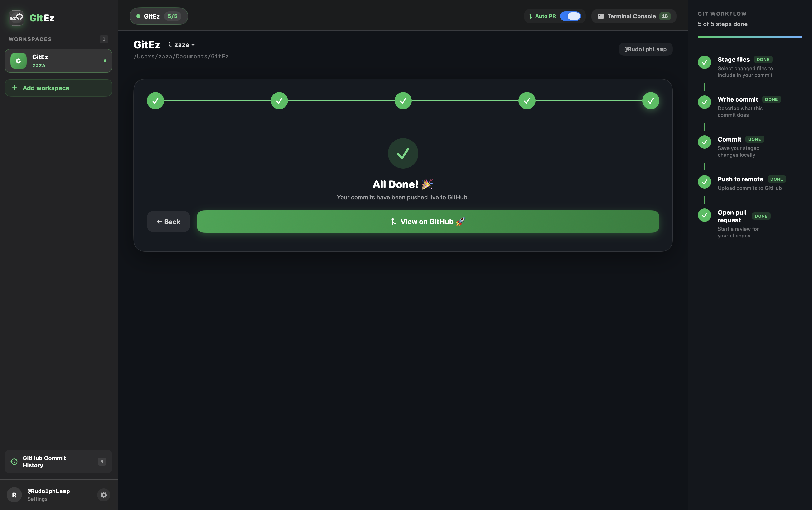

<div align="center">


# GitEz

### *Simple GitHub Workflows, Beautifully Done*

[](https://github.com/RudolphLamp/GitEz)
[](https://developer.apple.com/swift/)
[](LICENSE)
[](https://github.com/RudolphLamp/GitEz/releases)

---

**GitEz** is a native macOS application designed to simplify Git & GitHub workflows into an intuitive, step-by-step liquid glass wizard interface. 

</div>

---

## 🌟 Key Features

- **Liquid Glass Translucent UI**: Designed natively for macOS with translucent glassmorphic backdrop materials and soft dark aesthetics.
- **Guided Single-Step Wizard**: Walk step-by-step through staging files, writing commit messages, pushing, and opening GitHub Pull Requests.
- **Interactive Step Navigation**: Jump forward or backward between steps with circular progress indicators.
- **Auto PR Toggle**: Flexible top bar toggle to automatically launch GitHub PR comparison URLs or complete directly after pushing.
- **Live Branch Management**: Fetch remote branches from GitHub, switch local branches seamlessly, or create & checkout new branches on the fly.
- **Built-in IDE Shortcuts**: One-click launcher to open your active project directly in **VS Code**, **Cursor**, **Antigravity**, **Terminal**, or **Finder**.
- **Real-Time Embedded Terminal Console**: Inspect exact CLI commands, stdout, stderr, and exit codes in a live collapsible terminal drawer.
- **Interactive Commit History Pop-Up**: Browse recent commits with single-click navigation to view exact commits and diffs live on GitHub.
- **PAT & Private Repo Support**: Built-in GitHub Personal Access Token authentication for private repositories.

---

## 📸 Interface Preview

<div align="center">
  
</div>

---

## 🚀 Step-by-Step Workflow Pipeline

```
 1. Stage Files     ➔    2. Write Commit    ➔    3. Target Branch    ➔    4. Push to Remote    ➔    5. Open PR
  Select modified         Enter clear msg         Choose branch           Sync with GitHub          Launch PR view
```

---

## 📥 Installation

### Download pre-built DMG Installer (v1.1.0)
1. Download **`GitEz.dmg`** from the [Releases](https://github.com/RudolphLamp/GitEz/releases) page.
2. Open `GitEz.dmg`.
3. Drag **GitEz** into your `Applications` folder.
4. Launch and enjoy effortless Git workflows!

### Building from Source

Requirements:
- macOS 14.0 or later
- Xcode 15.0 or later

```bash
# Clone repository
git clone https://github.com/RudolphLamp/GitEz.git
cd GitEz

# Build with xcodebuild
xcodebuild -project GitEz.xcodeproj -scheme GitEz -configuration Release build
```

---

## 🤝 Contributing

Contributions, issues, and feature requests are welcome! Feel free to check the [issues page](https://github.com/RudolphLamp/GitEz/issues).

---

## 📄 License

Distributed under the MIT License. See `LICENSE` for more details.